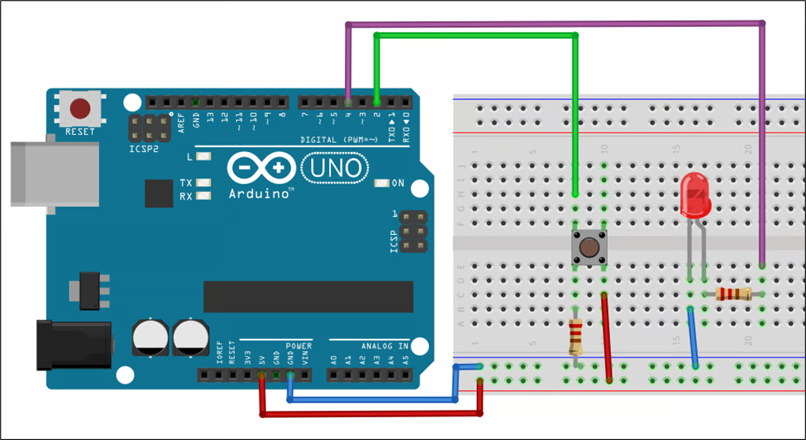
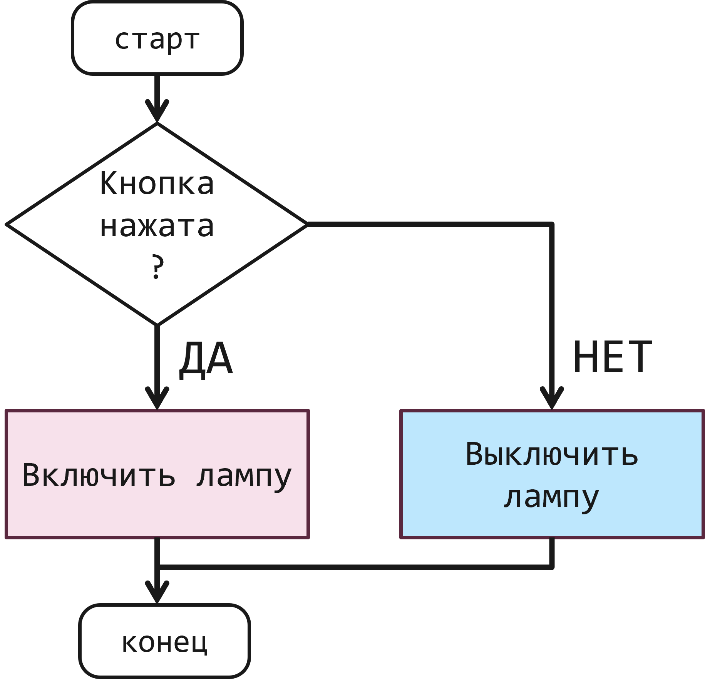
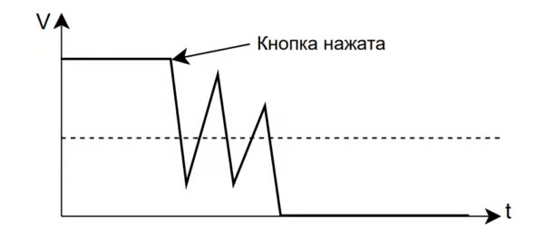
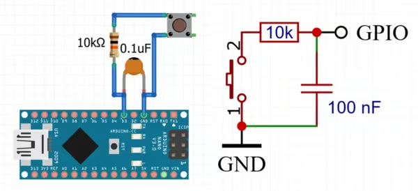
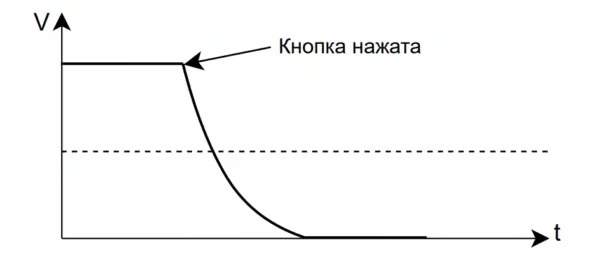

**Кнопка** – это простой механический переключатель, который замыкает (или размыкает) электрическую цепь, когда мы на него нажимаем. Вы наверняка встречали разные виды кнопок:

Кнопка нужна, чтобы дать человеку возможность взаимодействовать с устройством (включить, переключить режим, запустить процесс).

Кнопки бывают разных типов:

Фиксация:

-  **Без фиксации** *(momentary)* - после отпускания отключается обратно

-  **С фиксацией** *(latching)* - после отпускания остаётся нажатой

Поведение:

-  **Нормально разомкнутая** *(Normal Open, NO)* - при нажатии замыкает контакты

-  **Нормально замкнутая** *(Normal Closed, NC)* - при нажатии размыкает контакты

Функционально - кнопка замыкает контакт при нажатии, поэтому при считывании через нее сигнала на микроконтроллере можно узнать, нажата кнопка (сигнал есть) или нет (сигнала нет)

### Подключение к Arduino

Схема подключения (со светодиодом):

{width=1606px height=878px}

### Программа

В начале кода объявляем, куда подключили кнопку и светодиод:

```c++
#define knopka 2
#define lampa 4
```

Также нужно создать переменную типа int (integer - целое число) , в которую будем записывать состояние кнопки (то есть нажата она сейчас или нет). Назовем ее `knopka_state`. Изначально кнопка не нажата, начальное значение = 0.

```c++
#define knopka 2
#define lampa 4

int knopka_state = 0;
```

Далее нужно определить режим работы пинов в функции `setup()`. НА лампу отправляем сигнал, значит это ВЫХОД (output); С кнопки считываем сигнал, значит это ВХОД (input):

```c++
void setup() {
  pinMode(lampa, OUTPUT);
  pinMode(knopka, INPUT);
}
```

Перейдем к основному циклу программы.

Сначала нам нужно постоянно узнавать, нажата кнопка или нет, то есть считывать с нее значения в функции `loop()`. Для этого используется команда `digitalRead()`. Если кнопка нажата, будем получать 1, если не нажата – 0.

Но!! это значение нужно куда-то сохранять. Будем записывать его в переменную knopka_state:

```c++
void loop() {
  knopka_state = digitalRead(knopka);
}
```

Далее нужно написать условие: если кнопка нажата, включить лампу. В противном случае (иначе, если кнопка не нажата) - выключить лампу. Алгоритм выглядит так:

{width=1831px height=1765px}


Здесь нам нужно использовать конструкцию if...else. Подробно можно прочитать ниже:

:::info:true Использование условий в программе

Условие - один из вариантов **ветвления программы**, то есть выполнения разных участков кода в зависимости от определённых условий.

Самый простой вариант - условный оператор `if`. Он принимает **логическое выражение** и выполняет указанный код, если это выражение - `true` (true = *истинно*, например выражение: `"цвет этого текста - черный"` является истинным. а выражение `"дорогу надо переходить на красный цвет"` - *ложное*, или false).

У всех подобных конструкций есть два варианта:

-  Всегда можно указать блок кода `{}`, который выполнится после оператора

-  Если это одно действие - можно записать его напрямую, без блока

```c++
if (условие) действие1;

if (условие) {
    инструкция1;
    инструкция2;
}

// пустая инструкция - ничего не произойдёт, но и ошибки не будет
if (условие);
```

Если условие = `true` - выполнится действие, если нет - то нет.

Например, если температура выше 30 градусов - включить лампочку:

```c++
if (temp > 30) lampOn();
```

Так как оператор принимает логическое выражение, то любая переменная, являющаяся целым числом, отличная от нуля, является для него `true`, и только ноль - `false`. Например `if (50) {}` выполнится

А как выключить лампочку, если температура ниже? Здесь поможет оператор `else` - он выполнит код, если выражение в `if` **ложно**:

```c++
if (условие) действие1;     // если true
else действие2;             // если false

if (условие) {
    действие1;
    действие2;
} else {
    действие3;
    действие4;
}
```

Тот же абстрактный пример с лампочкой:

```c++
​if (temp > 30) lampOn();
else lampOff();
```

Если нужно обработать несколько промежуточных условий - есть конструкция `else if`:

```c++
​if (условие1) действие1;
else if (условие2) действие2;
else if (условие3) действие3;
// ....
else действие4;

if (условие1) {
    действие1;
    действие2;
} else if (условие2) {
    действие3;
    действие4;
} else {
    действие5;
    действие6;
}
```

-  Процессор будет проверять все условия, пока не дойдёт до результата `true` - после выполнения его инструкций остальные условия **проверяться уже не будут**

-  Если процессор нигде не получит результат `true` - будет выполнен код в `else`

-  `else` может отсутствовать

:::

Запишем это с помощью `if` внутри функции `loop()`:

```c++
void loop() {
 knopka_state = digitalRead(knopka);
 
  if (knopka_state == 1){
    digitalWrite(lampa, 1);
  } else {
    digitalWrite(lampa, 0);
  }
}
```

Обратите внимание: в условии `knopka_state == 0` используется двойной знак равенства ==:

-  двойное ==, когда сравниваем (задаем вопрос - а равно ли значение кнопки единице?)

-  одно =, когда задаем значение (например, значение лампы = 1)

Код целиком:

```c++
#define knopka 2
#define lampa 4

int knopka_state = 0;

void setup() {
  pinMode(lampa, OUTPUT);
  pinMode(knopka, INPUT);
}

void loop() {
 knopka_state = digitalRead(knopka);
 
  if (knopka_state == 1){
    digitalWrite(lampa, 1);
  } else {
    digitalWrite(lampa, 0);
  }
}
```

### Дребезг контактов кнопки

Кнопка не идеальна и контакт замыкается не сразу, какое-то время он механически "дребезжит" *(bounce)* - внутри кнопки находится металлическая платинка, которая колеблется при нажатии и отпускании. Прогоняя данный алгоритм, система опрашивает кнопку и условия приблизительно за 6 мкс, то есть кнопка опрашивается около 166'666 раз в секунду! Этого достаточно, чтобы получить несколько тысяч "нажатий" вместо одного:

{width=600px height=263px}

Для однозначного определения состояния кнопки дребезг нужно "погасить" - **debounce**.

Организация антидребезга также поможет избежать **помех**, которые могут приводить к ложным нажатиям кнопки. Например, при длинных проводах до кнопки, при использовании внутренней подтяжки пина и наличии рядом индуктивной нагрузки (мотор, реле, электромагнит)

Вот подробное описание классических способов устранения дребезга (материалы AlexGyver). Посмотрите, если вам интересно. Если нет - посмотрите ниже раздел про библиотеку EncButton.

:::info:true Антидребезг для кнопки

**Аппаратный антидребезг**

Дребезг можно погасить аппаратно - при помощи RC фильтра, образованного резистором и конденсатором:

{width=600px height=274px}

Сигнал будет выглядеть примерно так:

{width=600px height=256px}

**Программный антидребезг**

Гашение дребезга можно сделать и программно. Самый простой вариант - опрашивать кнопку не постоянно в цикле, а периодически, например каждые 50 мс (20 раз в секунду) - вполне достаточно для того, чтобы "пропустить" дребезг даже от самой плохой кнопки и снизить вероятность поймать внешние "помехи" почти до нуля:

```c++
void loop() {
    static bool pState = false;
    bool state = !digitalRead(BUTTON_PIN);

    if (pState != state) {  // состояние изменилось
        pState = state;     // запомнить новое
        if (state) Serial.println("Кнопка нажата");
        else Serial.println("Кнопка отпущена");
    }

    delay(50);  // ждём
}
```

Этот вариант очевидно плох наличием задержки, которая будет тормозить всю программу.

Более интересный вариант - ловим первое изменение сигнала пина и игнорируем остальные, пока идёт таймаут:

```c++
#define BUTTON_PIN 3
#define BTN_DEB 50  // тайм-аут смены состояния, мс

void setup() {
    Serial.begin(115200);
    pinMode(BUTTON_PIN, INPUT_PULLUP);
}

void loop() {
    static bool pState = false;
    static uint32_t tmr;

    bool state = !digitalRead(BUTTON_PIN);
    // состояние изменилось и вышел таймер
    if (pState != state && millis() - tmr >= BTN_DEB) {
        tmr = millis();     // сбросить таймер
        pState = state;     // запомнить состояние
        if (state) Serial.println("Кнопка нажата");
        else Serial.println("Кнопка отпущена");
    }
}
```

Этот вариант **мгновенно реагирует** на нажатие и отпускание, но может пропустить "помеху" - короткий скачок напряжения

:::

Для удобной работы с кнопками можно использовать библиотеки, например [EncButton](https://github.com/GyverLibs/EncButton), её можно установить/обновить из встроенного менеджера библиотек Arduino по названию **EncButton**. В этой библиотеке уже прописан антидребезг!

Создаем кнопку так:

```c++
Button btn(3); // в начале кода, вместо 3 - ваш пин, вместо btn - ваше название
```

Внутри функции loop() считываем значение кнопки такой командой:

```c++
btn.tick(); // эта строка может встречаться только 1 раз в loop!
```

Далее можем использовать нажатие кнопки, например в условиях

```c++
btn.press()    // произошло нажатие на кнопку 
btn.pressing() // сейчас кнопка удерживается
btn.hold()     // произошло удержание кнопки (дольше 600 мс)
btn.holding()  // сейчас кнопка удерживается (дольше 600 мс)
btn.click()    // произошло однократное нажатие\отпускание (клик на кнопку)
btn.release()  // произошло отпускание кнопки (после нажатия)
```

Например, та же самая программа, что и в начале - лампа горит, пока кнопка нажата:

```c++
#include <EncButton.h>
#define lampa 4
Button knopka(4);

void setup() {
  pinMode(lampa, OUTPUT);
}

void loop() {
 knopka.tick();
 
  if (knopka.pressing()){ //пока кнопка удерживается, лампа горит
    digitalWrite(lampa, 1);
  } else {
    digitalWrite(lampa, 0);
  }
}
```

Или другой пример, каждое нажатие кнопки инвертирует состояние лампы (то есть первый клик - лампа включилась, второй клик - лампа выключилась и т.д.):

```c++
#include <EncButton.h>
#define lampa 4
Button knopka(4);

void setup() {
  pinMode(lampa, OUTPUT);
}

void loop() {
 knopka.tick();
 
  if (knopka.click()){ //когда произошел клик на кнопку
    digitalWrite(lampa, !digitalRead(lampa)); // подаем на лампу тот же сигнал, что был, но инвертированный
  } 
}
```

### Задания для самостоятельного выполнения

#### Задание 1

Напишите код, который включает лампу, если кнопка НЕ нажата и выключает лампу, если кнопка нажата

#### Задание 2

Напишите код для двух кнопок и 2 светодиодов: при удержании 1й кнопки горит 1 лампа, при удержании 2й кнопки горит 2 лампа