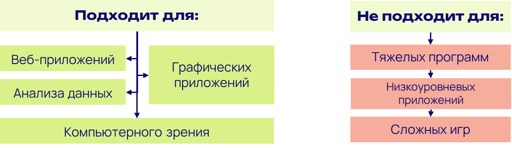
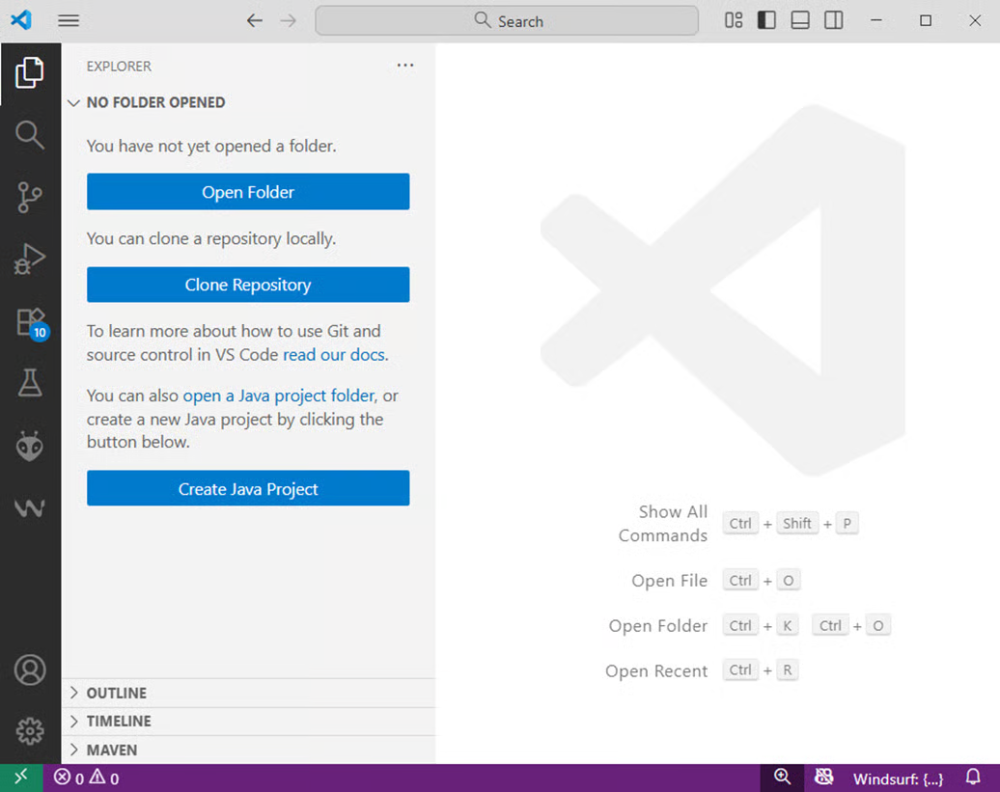
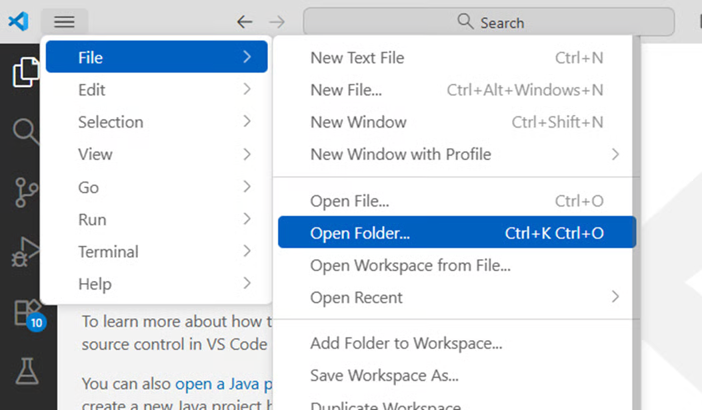
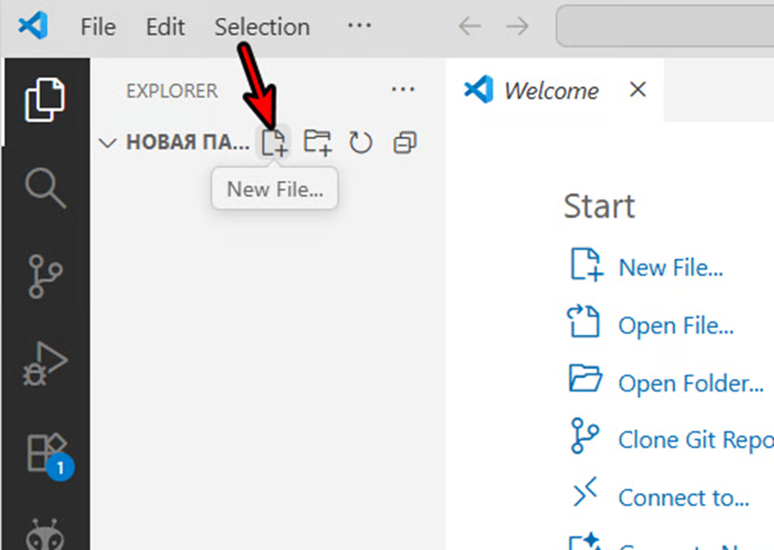
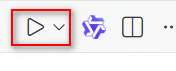
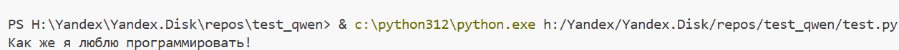

### [highlight:turquoise]Немного про Python[/highlight]

Язык Python в 1991 году создал Гвидо Ван Россум. Название выбрано в честь шоу «Monty Python’s Flying Circus»:

{width=750px height=548px}

Python имеет свои преимущества и недостатки. Они определяют, для чего он подходит, а для чего нет. Мы выбираем Python, потому что он прост для изучения и в нем много чего можно реализовать! А его основной недостаток - низкая скорость.

{width=1153px height=335px}

### [highlight:turquoise]Особенности синтаксиса Python[/highlight]

Python -- очень понятный язык. Далее рассмотрим его особенности.

#### 1) Отступы вместо скобок \{}

```python
if True:
    print("Робот едет вперёд")
```

В Python блок кода -- это группа инструкций (строчек кода), которые выполняются\
вместе и принадлежат к одной логической части программы, например:

-  телу условия ( `if` , `elif` , `else` ),

-  телу цикла ( `for` , `while` ),

-  функции или классу.

Как обозначается блок кода в Python?  В отличие от других языков программирования, где для группировки команд используются фигурные скобки `{ ... }` , в Python используется отступ слева (indentation).

\ Во вложенных блоках (список выше) отступ обязателен, иначе возникнет ошибка IndentationError!

\

Обычно используется 4 пробела на каждый уровень вложенности (рекомендация PEP 8). ЛИБО 1 tab (не стоит смешивать табы и пробелы, либо одно, либо другое)

#### 2) Не нужно указывать тип переменной

```python
speed = 50 # скорость робота
name = "Болт" # имя робота
```

#### 3) Комментарии начинаются с решётки

\<pre class="language-python">`**\# Это комментарий — он не влияет на работу программы**` `print("Старт!")` \</pre>

### [highlight:turquoise]Среда разработки[/highlight]

Мы будем использовать Visual Studio Code:

{width=1036px height=821px}

Создайте в "Документах" свою папку, в VS Code добавьте ее в рабочее пространство:

{width=1053px height=617px}

Чтобы создать новый файл кликните сюда:

{width=957px height=681px}

### [highlight:turquoise]Вывод данных[/highlight]

Простейшая программа: выводим надпись на экран. Сначала в VS code создайте новый файл, например, iot_start.py.

Далее в редакторе пишем код:

```python
print("Как же я люблю программировать!") 
```

Теперь нужно выполнить этот код. Для этого нажмите на значок play справа сверху или F5:

{width=176px height=71px}

Супер, текст выводится в терминал (внизу окна).

{width=1256px height=71px}

Попробуйте вывести любой другой свой текст.

Обратите внимание, что каждая команда print() заканчивается переводом строки. То есть такой код:

```python
print("Как же я люблю программировать!") 
print("А еще ходить в смену!") 
```

выведет текст на двух строках:

```python
Как же я люблю программировать!
А еще ходить в смену!
```

Команда print() без аргументов выведет просто пустую строку:

```python
print("Как же я люблю программировать!") 
print()
print("А еще ходить в смену!") 
```

получим:

```python
Как же я люблю программировать!

А еще ходить в смену!
```

Будьте внимательны, выше мы выводим только текст (string). Если хотим вывести число (и выполнять с ним математические операции например), то пишем его без кавычек: `print(55)`. Также и с переменной, если хотим вывести значение переменной, то в скобках указываем название переменной без кавычек: `print(temp)`.

:::tip 

Кстати, в python можно использовать любые кавычки: одинарные ' ', двойные " " или обратные 

:::

Также команда print() позволяет указывать несколько аргументов. Аргументы отделяются запятыми:

```python
print('Скоро я', 'буду программировать', 'на языке', 'Python!')
```

Получим:

```python
Скоро я⎵буду программировать⎵на языке⎵Python!
```

То есть если внутри print несколько аргументов, то python выведет их через пробел

Так можно, например, сочетать разные данные в одной функции print():

```python
print("Число", 443, "простое")
```

Также для красивого вывода в python сузествуют f-строки. Подробнее прочитайте [тут](https://pythonru.com/osnovy/formatirovanie-v-python-s-pomoshhju-f-strok).

Выглядит это так:

```python
print(f"Датчик {sensor_name} показывает {temperature}°C")
```

### [highlight:turquoise]Переменные[/highlight]

Часто в программе есть необходимость сначала запомнить какие-то данные, а потом использовать их в другом месте кода.

**Переменная** - это именованная ячейка в памяти устройства, к которой можно обратиться из программы.

Для создания переменной в питоне нам нужно написать название переменной и присвоить ей какое-то значение с помощью оператора “=”:

```python
my_age = 15
```

Для названий переменных есть несколько правил:

-  Имя переменной должно начинаться с буквы или символа подчеркивания

-  Имя переменной не может начинаться с цифры

-  Имя переменной может содержать только буквенно-цифровые символы и символы подчеркивания (A – z, 0–9 и \_)

-  Имена переменных чувствительны к регистру (age, Age и AGE - это три разные переменные)

В python есть разные типы данных (в коде их явно указывать не нужно, но нужно помнить, что число с текстом, например, сложить не получится):

```python
temperature = 25      # число (int)
humidity = 60.5       # число с точкой (float)
sensor_name = "DHT22" # текст (string)
is_alarm = False      # правда/ложь (bool)
```

### [highlight:turquoise]💻 Задачи для тренировки[/highlight]

**Задание 1: "Визитка датчика"**

**Часть А**

Напишите простую программу, которая имитирует вывод данных с датчика - температуру, влажность и название датчика

Создайте файл `sensor_report.py`. В коде добавьте 3 переменных: `sensor_name`, `temperature`, `humidity` и задайте им какие-то значения.

Напишите такой код, чтобы он делал примерно такой вывод:

```
****************************
Отчет датчика: Крутой датчик
****************************
Температура: 27 °C
Влажность: 15 %
****************************
```

**Часть Б**

Добавьте еще минимум два поля в вывод, например: давление (`pressure`), расположение датчика (`location`) или другие. Назначьте подходящие значения новым переменным и добавьте соотвествующие строки в вывод программы.

**Часть В**

Добавьте еще одно значение, которое будет выводиться в отчете датчика. Это значение - **точка росы.**

**Точка росы** -- это температура, при которой водяной пар, содержащийся в воздухе, начинает превращаться в капельки воды. Представьте холодную бутылку, которую достали из холодильника -- на ней сразу появляются капельки воды. Это происходит потому, что температура поверхности бутылки ниже точки росы окружающего воздуха.

:::tip 

Пример из жизни:

При температуре воздуха 20°C и влажности 60% точка росы составляет 12°C. Это означает, что если какая-либо поверхность охладится до 12°C или ниже, на ней начнет образовываться конденсат.

:::

Точка росы для данной температуры и данной влажности воздуха рассчитывается по формуле:

```
Tp = (b × α(T, RH)) / (a - α(T, RH))

где α(T, RH) = a × T / (b + T) + ln(RH/100)

постоянные значения:
a = 17.27, b = 237.7°C

значения Т (температура) и RH (влажность) вы берете из тех, что ранее задали у себя в коде

ln(значение) - это натуральный логарифм. 
Чтобы его рассчиать в питоне, напишите так: 
math.log(значение) 
и в начале кода добавьте строчку import math
```

**Задание 2: "Математика датчика"**

Добавьте в вывод программы не только значение температуры в цельсиях, но и в фаренгейтах и в кельвинах. Формулы:

```python
# Конвертация температур
temp_celsius = 25
temp_fahrenheit = temp_celsius * 9/5 + 32
temp_kelvin = temp_celsius + 273.15
```

**Задание 3: "Красивый вывод"**

Самостоятельно выясните, что такое colorama и попробуйте применить это для того, чтобы раскрасить вывод вашей программы в разные цвета


## [highlight:turquoise]Ввод данных[/highlight]

Это не понадобится для решения ближайших задач, но точно не будет лишним!

Если мы хотим передать программе какие-либо данные с клавиатуры, нужно использовать функцию input(). Она получает значение, введенное пользователем с клавиатуры.

Обычно данные, введенные пользователем, записывают в какую-то переменную с помощью оператора присваивания (=).

Например, в результате выполнения следующей строки кода в переменной a будет лежать введенное пользователем значение:

```python
a = input()
```

Единственным параметром, который мы можем передать в функцию input(), является строка, которая будет появляться перед местом для ввода данных.

```python
name = input("Введите свое имя: ")
```

Например такая программа считает имя пользователя, которое он введет с клавиатуры, и посдтавит в текст:

```python
name = input() 
print('Привет, ', name, '!')
```

Функция `input()` преобразует все введенные значения в строковый тип данных (str). Поэтому для корректной работы с числовыми значениями необходимо использовать встроенную функцию `int()`, которая преобразует строковый формат в числовой. Если мы заранее знаем, что на вход от пользователя получим число, то `int()` можно применять непосредственно к `input()`. Тогда в результате выполнения этих функций в переменной `age` будет лежать число:

```ini
age = int(input("Введите свой возраст: ")) 
```

То же самое можно записать следующим образом:

```ini
age = input("Введите свой возраст: ")
age = int(age)
```

### 💻 Задачи для тренировки

-  [highlight:peony]**Задание:**[/highlight] Напишите программу, которая считывает с клавиатуры название города и выводит надпись «Я живу в ХХ», где вместо XX - введенное пользователем название города

**Важно понимать:** Если данные передаются в программу одной строкой, то функцию input() следует вызвать один раз. В случаях, когда строк больше, количество переменных и input() должно соответствовать количеству строк. 

-  [highlight:peony]**Задание:**[/highlight] Напишите программу, которая считывает 2 строки, а потом выводит их обратно (также двумя строками).

**Важный нюанс:** input() всегда считывает значения, введенные пользователем, как **строку** (текст). Поэтому для корректной работы с **числовыми** значениями необходимо использовать встроенную функцию

```python
int(то что хотим преобразовать в число)
```

которая преобразует строковый формат в числовой.

Если мы заранее знаем, что на вход от пользователя получим число, то int() можно применять непосредственно к input():

```python
age = int(input())
```

-  [highlight:peony]**Задание:**[/highlight] Напишите программу, которая считывает с клавиатуры число и выводит его же, но умноженное на 2

-  [highlight:peony]**Задание: **[/highlight]Напишите программу, которая считывает с клавиатуры число и выводит это число, но в квадрате

-  [highlight:peony]**Задание: **[/highlight]Напишите программу, которая просит пользователя ввести 1 число и затем выводит текст в следующем формате:



---

*  

   57

*  

   Предыдущее для 57 число это 56

   Следующее за 57 число это 58



|